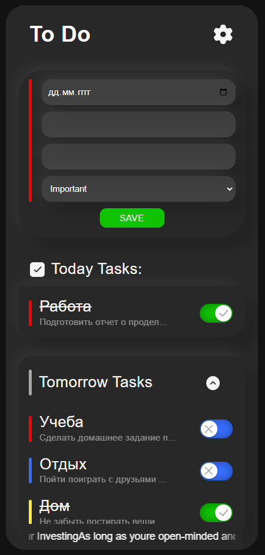
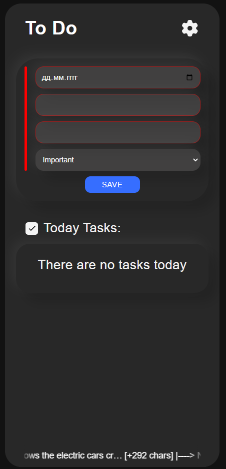
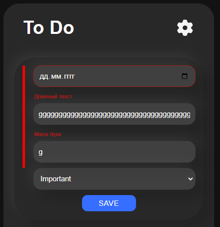
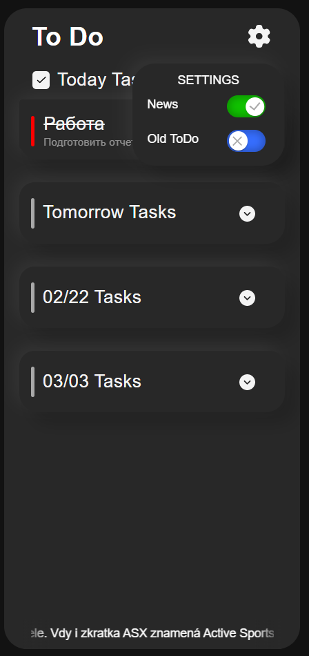

# Todo list

**Demo project:** [todo_list](https://todo-list-9s3l.vercel.app/).

**[Образец]** -Пример заполненной ToDo.



## Краткое описание
У нас есть TODO List, где мы можем добавить запись, того что нам необходимо сделать в какой-либо из дней, помимо этого указать важность todo, что подтверждает ее цвет (красный-important, синий-middle, желтый-lite). 



## Форма для добавления todo
В форме необходимо указать дату, тему, описание, а также выбрать степень важности выполнения (красный-important, синий-middle, желтый-lite). Форму можно закрыть нажав на To Do в верхней части экрана, чтобы не мешалась. В форму добавлена валидация для каждого input.




## Шестеренка настройки (Settings)
При нажатии на settings у нас открывается блок где мы можем отключить нижнюю строку с новостью и открыть старые todo. Наведя мышкой на новость, она останавливается для прочтения.




## Просмотр Todo

Мы можем раскрыть любой из дней для более детального просмотра всех todo. Каждое задание можно вычеркнуть переключив switch. При наведении на описание todo открывается более подробное содержание.


## Стек технологий

```
Next
React Context
React Query
MUI
TypeScript
Axios
Scss
```
